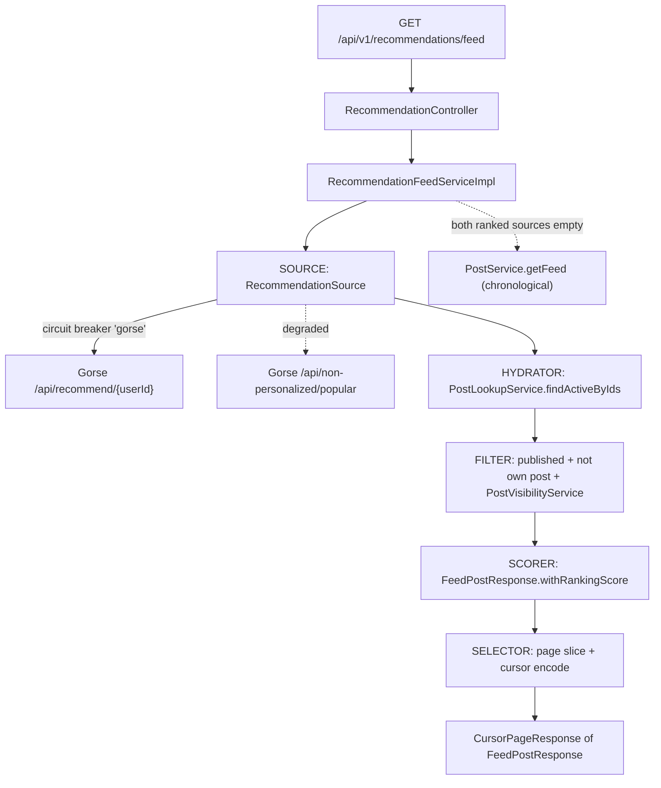
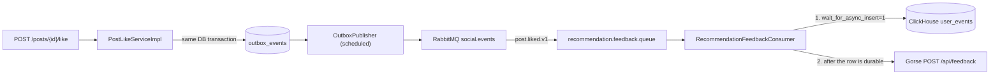

# Recommendation Module

Personalized "for you" post feed backed by [Gorse](https://github.com/gorse-io/gorse), an open-source recommender engine.

The application does not train models itself.
It records engagement as behavioral events, forwards them to Gorse, and reads back a ranked candidate list that it hydrates, filters, and pages.

Data-layer contracts for this module live in [DATA_RULES.md](DATA_RULES.md).
The verified Gorse API contract and its deployment live in [`gorse/README.md`](../../../gorse/README.md).

---

## 1. What it provides

| Capability | Entry point |
|---|---|
| Personalized ranked feed | `GET /api/v1/recommendations/feed` |
| Engagement capture (like, save, comment, share, comment like, view) | `recommendation.feedback.queue` consumer |
| Behavioral event log | ClickHouse `luvax_analytics.user_events` (append-only, monthly partitions, 12-month retention) |
| Rebuilding Gorse from the canonical data | The operator-triggered rebuild (section 7) |
| Graceful degradation when the recommender is down | popularity ranking, then the chronological following feed |

The pre-existing chronological feed at `GET /api/v1/posts/feed` is untouched.
The two endpoints coexist: "Following" (chronological) and "For You" (ranked).

---

## 2. Architecture

Gorse runs as a separate container and is reached only over REST.
No domain code depends on Gorse internals, so the engine can be replaced without touching the post or social modules.

### Read path

The pipeline is split into explicit stages so each concern is independently testable.



The **filter** stage is what makes the ranked list safe to serve.
Gorse knows nothing about blocks, private accounts, or post status, so every candidate it returns is re-checked against `PostVisibilityService` and the `PUBLISHED` status before it reaches the client.
The viewer's own posts are also dropped.

Because filtering removes candidates, the service over-fetches (`app.gorse.recommend-multiplier`, default 2x) and loops up to 5 source round trips until the page is full.

### Write path

Engagement never calls Gorse synchronously.
It goes through the existing transactional outbox so a recommender outage can never fail a user's like or save.



`user_events` in ClickHouse is the canonical record, and it is written before Gorse, so Gorse never holds feedback without a durable record.
Gorse holds only derived state, so it can always be rebuilt from PostgreSQL and ClickHouse by the rebuild tool (see §7).
The consumer stores the exact Gorse feedback type and value it sent in `feedback_type` and `feedback_value`, which is what lets a rebuild reproduce the live pipeline's accumulated values.

The behavioral events that are not engagement (`session_start`, `search`, `profile_view`) are written by `UserEventRecorder` straight to ClickHouse and never reach Gorse.
Server-side events that must not reach Gorse can travel through `recommendation.user-event.imported.v1` and `UserEventImportConsumer`.

---

## 3. Source layout

```text
src/main/java/com/app/modules/recommendation/
├── api/RecommendationApi.java                 # OpenAPI contract + @RequestMapping
├── controller/RecommendationController.java   # auth, rate limiting, response envelope
├── client/
│   ├── GorseClient.java                       # REST contract
│   ├── GorsePurger.java                       # truncates Gorse's store; seed reset and rebuild share it
│   ├── impl/GorseClientImpl.java              # RestClient calls, no fallback logic
│   └── dto/                                   # Gorse wire records (PascalCase JSON)
├── config/
│   ├── GorseProperties.java                   # app.gorse.* binding
│   └── GorseClientConfig.java                 # RestClient bean, default headers, timeouts
├── consumer/
│   ├── RecommendationFeedbackConsumer.java    # ClickHouse row, then Gorse feedback
│   └── UserEventImportConsumer.java           # imported events, never sent to Gorse
├── messaging/RecommendationRabbitBindingConfig.java
├── rebuild/                                   # operator-triggered Gorse rebuild (section 7)
├── repository/
│   ├── UserEventAnalyticsRepository.java      # every ClickHouse read and write of user_events
│   └── UserHashtagAffinityRepository.java     # affinity upsert over the staged ClickHouse signals
└── service/
    ├── RecommendationFeedService.java
    ├── UserEventRecorder.java                 # fire-and-forget analytics writes
    └── impl/
        ├── RecommendationFeedServiceImpl.java # orchestration, cursor, fallback chain
        └── feed/RecommendationSource.java     # candidate source + circuit breaker
```

Cross-module access is restricted to service interfaces (`PostLookupService`, `PostVisibilityService`, `PostService`).
`PostLookupService` was added to the post module specifically so this module never reaches into another module's repositories or `impl` package.

---

## 4. API

### `GET /api/v1/recommendations/feed`

Requires authentication.
Rate limiter: `highTraffic`.

| Parameter | Type | Default | Notes |
|---|---|---|---|
| `cursor` | string | none | Opaque cursor from the previous page |
| `limit` | int | 20 | Clamped to 1–100 |

Returns `ApiResponse<CursorPageResponse<FeedPostResponse>>`.
`FeedPostResponse.rankingScore` carries the recommender score and decreases down the page; it is `null` on chronological-fallback pages.

**Cursor format** — base64 of `<source>:<offset>`, where source is `g` (Gorse personalized) or `p` (popularity).
`g:0` encodes to `Zzow`.
A cursor that does not match this shape is treated as a chronological-feed cursor and delegated to `PostService.getFeed`, so pagination survives a mid-scroll fallback.

---

## 5. Feedback mapping

Gorse classifies feedback by **type**, not by numeric weight.
`like`, `save`, and `comment` are configured as positive types; `read` is configured as the read type, in `gorse/config/config.toml`.

| App event | Gorse `FeedbackType` | Value | `user_events.event_type` |
|---|---|---|---|
| `post.liked.v1` | `like` | 1.0 | `post_like` |
| `post.saved.v1` | `save` | 1.0 | `post_save` |
| `comment.created.v1` | `comment` | 1.0 | `post_comment` |
| `post.shared.v1` | `share` | 1.0 | `post_share` |
| `comment.liked.v1` | `like` | 0.5, attributed to the parent post | `comment_like` |
| `post.viewed.v1` | `read` | dwell seconds, or 1.0 | `post_view` |

`post.viewed.v1` is published by `POST /api/v1/posts/{postId}/view` (post module) and is the only read-class signal; a view by the post's own owner is accepted but not recorded, so it never reaches this pipeline.

Deliberately excluded:

- Story views, which are recorded in `user_events` only.
- `user.followed.v1` — a user-to-user edge, not user-to-item feedback.
- Unlike and unsave — withdrawal of positive feedback is not propagated.

---

## 6. Configuration

| Property | Env var | Default | Purpose |
|---|---|---|---|
| `app.gorse.base-url` | `APP_GORSE_BASE_URL` | `http://localhost:8088` | Use `http://gorse:8088` when the app runs inside the compose network |
| `app.gorse.api-key` | `GORSE_API_KEY` | empty | Sent as `X-API-Key`; environment only, never stored in the database or an event payload |
| `app.gorse.connect-timeout` | `GORSE_CONNECT_TIMEOUT` | `PT2S` | |
| `app.gorse.read-timeout` | `GORSE_READ_TIMEOUT` | `PT3S` | |
| `app.gorse.recommend-multiplier` | `GORSE_RECOMMEND_MULTIPLIER` | `2` | Candidate over-fetch factor to absorb filtering |
| `app.recommendation.consumer.enabled` | `RECOMMENDATION_CONSUMER_ENABLED` | `false` | Enabled in the `dev` and `prod` profiles |
| `app.recommendation.consumer.concurrency` | `RECOMMENDATION_CONSUMER_CONCURRENCY` | `4` | Feedback consumer threads; each write waits for its ClickHouse part to be flushed and synced |
| `app.recommendation.read-set-window` | `RECOMMENDATION_READ_SET_WINDOW` | `P90D` | How far back the exhaustion topup reads |
| `app.recommendation.read-set-max-rows` | `RECOMMENDATION_READ_SET_MAX_ROWS` | `2000` | Cap on the read-set |
| `app.recommendation.gorse-rebuild.requests-per-second` | `GORSE_REBUILD_REQUESTS_PER_SECOND` | `5` | Rate limit of the rebuild's Gorse calls |
| `app.recommendation.gorse-rebuild.user-batch-size` | `GORSE_REBUILD_USER_BATCH_SIZE` | `500` | Users per rebuild batch |
| `app.recommendation.gorse-rebuild.item-batch-size` | `GORSE_REBUILD_ITEM_BATCH_SIZE` | `500` | Posts per rebuild batch |
| `app.recommendation.gorse-rebuild.feedback-batch-size` | `GORSE_REBUILD_FEEDBACK_BATCH_SIZE` | `1000` | Feedback tuples per rebuild request |
| (read from the environment, like `SEED_DATA`) | `GORSE_REBUILD`, `GORSE_REBUILD_TOKEN` | unset | Trigger and name of a rebuild run (section 7) |

Circuit breaker instance `gorse` is defined in `src/main/resources/resilience/circuitbreaker/resilience4j-{dev,prod}.yml`.
The `clickhouse` breaker and the `app.analytics.*` keys that govern the ClickHouse side are described in `.claude/rules/struct.md` (Analytics - ClickHouse), and the `gorseRebuild` rate limiter is in `resilience/ratelimiter/resilience4j-{dev,prod}.yml`.

---

## 7. Runbook

### Start the stack

```bash
docker compose -f docker-compose.yaml -f gorse/docker-compose.gorse.yml up -d
```

The Gorse dashboard is bound to loopback only.
On a VPS, reach it through an SSH tunnel:

```bash
ssh -L 8088:localhost:8088 <vps-host>
```

### Seed a demo dataset

Generates 8 topic personas, 202 users, 800 text posts, and roughly 22,500 interactions.

```bash
python gorse/seed/seed.py all --api-key "$GORSE_API_KEY" --sql-out seed.sql
```

Apply the generated SQL to a **fresh** application database, then wait one fit cycle (`fit_period`, set to 2 minutes for demos) and check persona separation:

```bash
python gorse/seed/seed.py verify --api-key "$GORSE_API_KEY"
```

Every seeded account uses the password `Password123!`, with the email address listed for it in `src/main/resources/seed/users.json`.
The two demo accounts are `demo_an` (football, travel) and `demo_binh` (cooking, fashion).

### Rebuild Gorse

Gorse holds only derived state.
If its database is lost, or its dataset drifts from the real `posts` and `users` tables, the rebuild tool re-syncs it from PostgreSQL and ClickHouse.
Its design and phases are in [DATA_RULES.md](DATA_RULES.md), section 3E.

`python gorse/seed/seed.py push` does **not** do this, despite the name.
It pushes that script's own synthetic 8-topic demo dataset, unrelated to whatever is in the application's database.

**Before you start**
- The backend must be running with ClickHouse reachable: the tool reads the feedback from ClickHouse and `PREFLIGHT` fails if the analytics schema is not ready.
- The application's PostgreSQL role must hold `TRUNCATE` on the seven tables of the `gorse` database (`documents`, `feedback`, `items`, `message`, `time_series_points`, `users`, `values`).
  If it does not, the run ends `FAILED` in `PREFLIGHT` with `Gorse's store cannot be purged: role <role> lacks the TRUNCATE privilege on gorse.public.<table>` and changes nothing.
- Note the feed as three test accounts see it, and Gorse's item, user and feedback totals, so the result can be compared.

**Run it**
1. Set `GORSE_REBUILD=true` and `GORSE_REBUILD_TOKEN=<name for this run>` (a date and a counter, for example) on the backend and restart it.
   The token is required; without it the runner logs `GORSE_REBUILD is set but GORSE_REBUILD_TOKEN is empty` and does nothing.
2. Follow the `[gorse-rebuild] token=<token>` log lines, or the `luvax_gorse_rebuild_phase` gauge, until the phase reaches 7 and the log shows `phase=DONE users=<n> items=<n> feedback=<n> feedbackSkipped=<n>`.
3. Unset both variables and restart.
4. After one `fit_period`, check the same three feeds: every id resolves to a published post, and Gorse's item count matches the catalogue.

**What the status means**

| Run status | Meaning | What to do |
|---|---|---|
| `RUNNING` | In progress, or the process died mid-run | Restart with the same token; it resumes from its phase and checkpoint |
| `FAILED` | A phase failed (Gorse unreachable, preflight refused, a 4xx) | Fix the cause and restart with the same token |
| `FAILED_VERIFICATION` | The final comparison found a difference; the log names the counts and up to 20 ids | Investigate; the run is final, so a retry needs a new token |
| `DONE` | Finished and verified | Nothing; a restart with the same token logs `already finished` and does nothing |

While the rebuild runs, the feedback listener is suspended so no live feedback interleaves; its messages wait in `recommendation.feedback.queue` and are applied afterwards on top of the rebuilt state.

**Alternative for a development database**: a full `SeedRunner` reseed (`SPRING_PROFILES_ACTIVE=dev,seed SEED_DATA=true`, see `src/main/resources/seed/README.md`) truncates Gorse's store through `GorsePurger` and replays every post through the real outbox, but it also regenerates every other seedable table.

---

## 8. Failure behavior

The read path degrades in three steps and never returns an error because the recommender is unavailable.

1. Gorse `/api/recommend` fails or the circuit is open → the popularity ranking serves the page, and the cursor source flips to `p`.
2. The popularity ranking is also unavailable → the chronological following feed serves the page, with `rankingScore` null.
3. Only genuine client-side faults (4xx from Gorse) surface as errors, because masking them would hide a bug.

The read-set that backs the exhaustion topup comes from ClickHouse; if that read fails, the topup is skipped and Gorse's own results are served alone, without touching the `gorse` breaker.

On the write path, the consumer writes ClickHouse first and then Gorse.
A failed Gorse push is retried with backoff and then dead-lettered to `recommendation.feedback.dlq`, and a 4xx response skips retries and dead-letters immediately.
No feedback is lost in either case: the ClickHouse row is the canonical record, and DLQ replay is manual.
An actor that no longer exists is dead-lettered once, because ClickHouse has no foreign key to refuse the row.

A ClickHouse outage is handled differently, so it cannot drain the queue into the DLQ: the consumer nacks with requeue, and once the `clickhouse` circuit breaker opens `AnalyticsIngestionController` stops the listener containers, so the messages wait ready in `recommendation.feedback.queue` until the breaker half-opens and the listeners start again.

Duplicate message delivery is absorbed by the shared inbox (`processed_messages`).
Because `ProcessedMessageService.processOnce` is transactional, a failed handler rolls back the inbox marker, and the retry re-runs cleanly: the ClickHouse insert is not part of that transaction, but the retry inserts an identical row (same id, same values), which the engine folds away.

---

## 9. Known limitations

These are accepted trade-offs, not defects.

- **Recommendations lag by one fit cycle.** New feedback reaches Gorse within seconds, but the ranking only changes after the next training run. Live demos should be narrated around this delay.
- **The Gorse HTTP call runs inside the inbox transaction.** This buys atomic rollback-and-retry, at the cost of holding a database transaction open for the duration of the call (bounded by the 3 s read timeout). Acceptable at current volume; revisit if feedback throughput grows.
- **Pagination is not snapshotted.** A training run between two page requests can reorder items, so a post may repeat or be skipped across pages.
- **Deduplication is per-request only.** Items already shown on an earlier page can reappear later.
- **A mid-pagination fallback reuses the offset.** If Gorse fails while the reader is deep in the list, the same numeric offset is applied to the popularity list, skipping its head. Only reachable when the recommender fails mid-scroll.
- **Recommendations can lag behind an out-of-band data reset.** Gorse's item, user and feedback store is derived state kept in sync by `PostIndexSyncConsumer` (`post.index.upsert.v1` / `post.index.delete.v1`, the same events that drive the Elasticsearch sync) as posts are created, updated, hidden on removal and restored. That consumer relies on the outbox, so it only sees writes that go through the application. If PostgreSQL's `posts` table is reset by a path that does not replay through the outbox, Gorse keeps whatever items it already had, which can drift entirely out of overlap with the current `posts` table without any error, because every Gorse call still succeeds and the candidates just fail to resolve to a live post. The Gorse rebuild tool (section 7) is the repair, and it verifies the catalogue against PostgreSQL in both directions before it reports `DONE`.
- **No negative feedback.** There is no "not interested" signal, and unlike/unsave do not retract prior positive feedback.

---

## 10. How it works, in short

Useful framing for a design review or thesis defense.

**What Gorse does.**
It collects user-item feedback and periodically trains a collaborative filtering model - matrix factorization, which represents every user and every item as a latent vector so that a predicted score is their dot product.
It also computes item and user neighbors.
Those three, plus time-decayed trending, are merged into one candidate list and re-ranked by a factorization machine, which is what lets features beyond the user-item pair - notably a post's hashtag labels - influence the final order.
The factorization machine trains read feedback as its negative examples, which is why impressions are ingested at all.
Results are precomputed into a cache, so the recommend API is a cache read rather than a model inference, which keeps it fast.

**Why a separate service.**
Training is a periodic, CPU-heavy workload.
Isolating it in its own process keeps it away from the request path of the main API, and confining the integration to REST plus a message queue means the engine can be swapped without touching domain code.

**Why the outbox instead of calling Gorse inside the request.**
The domain write and the event record commit in the same database transaction, so they can never diverge.
Publishing happens afterwards with broker confirms, retries, and a dead-letter queue.
A recommender outage therefore degrades recommendations without ever failing a user's like or save.

**Cold start.**
A user with no history is served by Gorse's configured fallback recommender, `non-personalized/trending`, then by the application's own popularity and chronological fallbacks.
Trending is positive feedback count divided by item age raised to a fractional power, so a new post competes on recent engagement rather than having to out-accumulate the whole back catalogue; a plain all-time count would pin the same viral posts to every cold-start session permanently.

**Repeat suppression.**
Posts a user has already read are not excluded permanently.
Gorse's own replacement is disabled (`enable_replacement = false`, measured and rejected in `gorse/config/config.toml`), so Gorse excludes read items outright, and `RecommendationSource` backfills from trending, unread candidates first and read ones only at the tail, once Gorse's list runs short.
That is deliberate on a catalogue of roughly seven hundred published posts: impression-level read marking exhausts it within a handful of sessions, and permanent exclusion would leave every recommendation surface blank.
